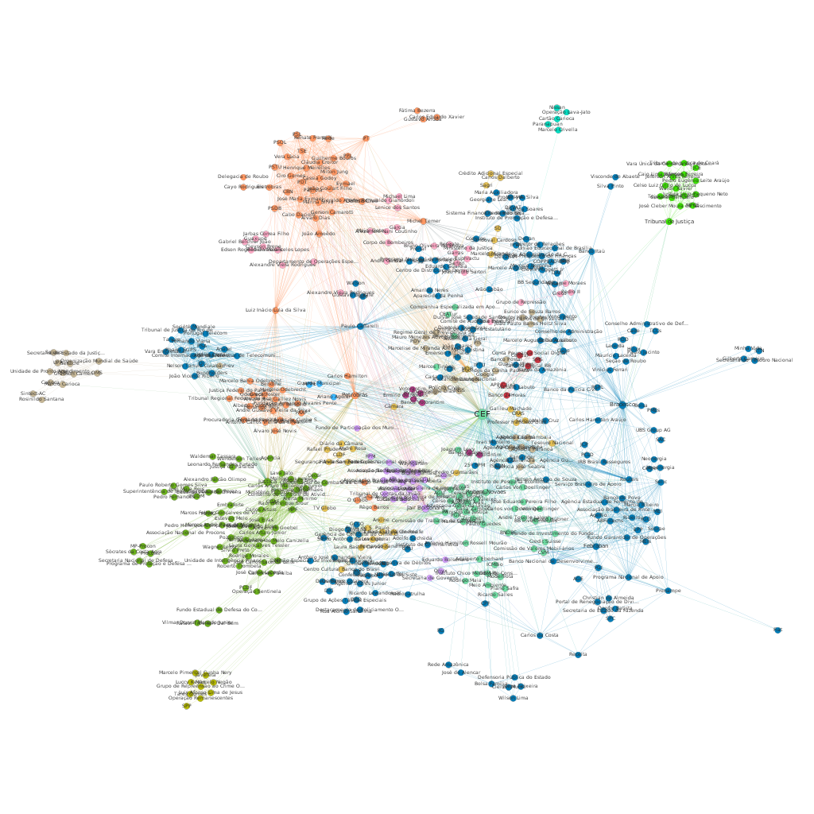

```{r setup, include=FALSE}
knitr::opts_chunk$set(echo = TRUE, warning = FALSE, fig.width = 12, fig.height = 8, message = FALSE)
```

# Mineração de Texto e Análise de Redes Sociais

 Diretrizes:  
 
 Buscar notícias relacionadas ao **Banco do Brasil S.A.**  
 
 Para tal acessaremos o portal de notícias G1.  
 
 As etapas dessa atividade serão:  
 
 1. Acessar os links sobre as notícias do **Banco do Brasil** presentes na página de busca no portal.
 2. Acessar cada um dos links e recuperar as notícias.
 3. Fazer uma mineração dos dados usando o pacote *tm* (Text Mining).
 4. Analisar as notícias usando o pacote *spacyr*.
 5. Criar uma lista de arestas para exportar para o *Gephi*.
 6. Criar uma visualização no *Gephi* e analisar as principais estatísticas para finalizar a tarefa.


```{r include=FALSE}
# limpando a memória
rm(list = ls())

# =====================================================================================
# instalando e preparando o ambiente para o spaCyR
# -------------------------------------------------------------------------------------
# configurado para ambiente Linux
# diretório de configuração do RStudio no ambiente Linux
dir_env <- '~/.rstudio-desktop/venv'

# Carregando a biblioteca reticulate
if (!'reticulate' %in% installed.packages()[, "Package"]) {
  install.packages('reticulate')
} 

if (!'spacy_virtualenv' %in% list.dirs(dir_env, 
                                       recursive = FALSE, full.names = FALSE)) {
  require(reticulate)
  
  # criando o ambiente para instalação da biblioteca SpaCy em Python para uso no RStudio
  virtualenv_create(envname = paste(dir_env, '/spacy_virtualenv', sep = ''))
  
  # instalando a biblioteca SpaCy em Python para uso no RStudio
  py_install("spacy", envname = paste(dir_env, "/spacy_virtualenv", sep = ''),
             method = "virtualenv")
  
  # instalando o miniconda caso ele não esteja instalado
  install_miniconda()
  
  # imprimindo as variáveis de ambientes setadas pelo pacote reticulate
  py_config()
  
  # retirando da memória o pacote reticulate para não conflitar com o Python do pacote spacyr
  detach(package:reticulate)
  
  # reiniciando a sessão do RStudio para evitar conflito com o Python do pacote spacyr
  rstudioapi::restartSession()
}
# =====================================================================================

# =====================================================================================
# Carregando os pacotes necessários
# -------------------------------------------------------------------------------------
list.packages <- c('rvest',
                   'stringr',
                   'dplyr',
                   'purrr',
                   'tm',
                   'igraph',
                   'wordcloud',
                   'urltools',
                   'spacyr',
                   'ggplot2',
                   'gtools',
                   'cluster',
                   'factoextra',
                   'RColorBrewer')
new.packages <- list.packages[!(list.packages %in% installed.packages()[, "Package"])]
if (length(new.packages)) install.packages(new.packages, dependencies = TRUE)
for (package in list.packages) {
  require(package, character.only = TRUE)
}
# =====================================================================================

# =====================================================================================
# instalando a biblioteca spaCy em Python no miniconda para uso no RStudio
# -------------------------------------------------------------------------------------
if (!find_spacy_env()) {
  spacy_install(lang_models = c('en_core_web_sm','pt_core_news_sm'))

  # download do modelo do SpaCy para a lingua portuguesa
  spacy_download_langmodel_virtualenv(model = c('pt_core_news_sm', 'en'),
                                      virtualenv_root = dir_env)
}

# inicializando o pacote SpaCy
spacy_initialize(model = "pt_core_news_sm")
# =====================================================================================
```

 Criando as funções que serão utilizadas nesse estudo.
 
```{r}
# Função para acessar as páginas
scrape_post_links <- function(site) {

  # lendo o HTML 
  source_html <- read_html(site)

  # obtendo o link através das tags
  links <- source_html %>%
    html_nodes("div.widget--info__text-container") %>%
    html_nodes("a") %>%
    html_attr("href")

  # eliminando os links com NA
  links <- links[!is.na(links)]

  # retornando os links
  return(links)
}

# Função para extrair a URL verdadeira 
# que está no link codificado (tag u).
extract_urls <- function(raw_url) {
  params <- urltools::param_get(raw_url)
  scraped_url <- params$u
  return(url_decode(scraped_url))
}

# Função para extrair o corpo da reportagem
scrape_post_body <- function(site) {
  # Escapa de 404 Not Found Errors
  # ou qualquer erro gerado no trecho de código abaixo
  try(
    text <- site %>%
      read_html %>%
      html_nodes("article") %>%
      html_nodes("p.content-text__container") %>%
      html_text
  )
}
```
 
 Obtendo o conteúdo das reportagens que são relacionadas ao Banco do Brasil.
 
```{r}
# Atribuindo a URL raiz
root <- "https://g1.globo.com/busca/?q=Banco+do+Brasil"

# Criando todas URLs paginadas
all_pages <- c(root, paste0(root, "&page=", 1:50))

# Obtendo os links através da função. 
# O retorno é uma lista de listas, onde cada elemento da lista é uma página.
# E cada página contém uma lista de links para as reportagens.
all_links <- lapply(all_pages, scrape_post_links)

# Convertendo a lista de listas em um vetor.
all_links <- unlist(all_links)

# Obtendo os links verdadeiros das reportagens utilizando a função criada
cleaned_links <- lapply(all_links, extract_urls)

# Retirando as reportagens que possuem somente vídeo
cleaned_links <- Filter(function(x) !any(grepl("globoplay", x)), cleaned_links)


# Extraindo o corpo das reportagens
data <- lapply(cleaned_links, scrape_post_body)
data <- lapply(data, function(item) paste(unlist(item), collapse = ''))
```
 
 Tratando e limpando as reportagens capturadas. 

```{r}
# Convertendo o conteudo para letras minúsculas
data_clean <- tolower(data)

# Removendo os números do conteúdo
data_clean <- removeNumbers(data_clean)

# Removendo stopwords
data_clean <- removeWords(data_clean, c(stopwords("pt"), 
                                        "banco do brasil", 
                                        "bb", 
                                        "banco", 
                                        "brasil",
                                        "segundo",
                                        "dia",
                                        "ano",
                                        "ainda",
                                        "empresa",
                                        "nova"))

# Removendo a pontuação.
data_clean <- removePunctuation(data_clean)

# Removendo os espaços no início e fim de cada conteúdo.  
data_clean <- str_trim(data_clean)
```

 Preparando os dados para a construção da coleção de textos.
 
```{r}
# Converte o vetor de conteudo para um Corpus.
corpus <- Corpus(VectorSource(data_clean))

# Stemizando as palavras do conteúdo (transformando todas as palavras para seu radical) 
corpus_stem <- tm_map(corpus, stemDocument)

# Obtendo uma matriz para a coleção de textos
tdm <- TermDocumentMatrix(corpus_stem)
tdm_matrix <- as.matrix(tdm)

# Obtendo o número de palavras em cada reportagem 
freq_tdm <- sort(rowSums(tdm_matrix), decreasing = TRUE)

# Filtrando as palavras que não contém letras
freq_tdm <- freq_tdm[grepl("^[a-z]+$", names(freq_tdm))]


# Criando um data frame com a frequências das palavras
df_freq_tdm <- data.frame(word = names(freq_tdm), freq = freq_tdm)
```
 
 Criando uma nuvem de palavras.
 
```{r}
wordcloud(words = df_freq_tdm$word,
          freq = df_freq_tdm$freq,
          min.freq = 10,
          max.words = 500, 
          random.order = FALSE,
          rot.per = 0,
          colors = brewer.pal(12, "Paired"))
```

 Nota-se pelo gráfico o conjunto de palavras como presidente, o nome do presidente da empresa em exercício e nome do ministro da economia na nuvem de palavras. Isso é esperado dado que se trata de um banco público, com controle da união, então é natural que tenhamos palavras que representam a união ligadas ao banco.
 Na nuvem também destaca-se as palavras relacionadas ao negócio da empresa, como trata-se de um banco vemos palavras como client, conta, caixa, dinheiro e economia.
  
 Abaixo plotamos um gráfico com os termos com frequências maior que 150.

```{r}
df <- df_freq_tdm %>% filter(freq > 150)
df %>% ggplot(aes(x = reorder(df$word, -df$freq), y = freq)) +
  geom_col(fill = "#1f78b4") +
  scale_y_continuous(breaks = c(0,25,50,75,100,125,150,175,200,225,250,275,300)) +
  labs(x = "Termos", y  = "Frequência", title = "Termos com Frequência > 150") +
  coord_flip()
```

 O gráfico que traz a lista dos termos com frequência maior que 150 mostra uma incidência grande no nome pessoal do atual presidente do país, assim como a palavra *president*, *governo*, *feder* e nome pessoal do ministro da economia que se relacionam com a figura do governo federal que é o detentor do controle acionário da empresa. 
 Podemos notar também algumas palavras relacionadas ao negócio da empresa, assim como ocorreu na nuvem de palavras como *economia*, *caixa*, *dinheiro*, *conta*, *client* e *pessoa*.
 O gráfico destaca melhor que a nuvem de palavras os verbos que podemos associar a possíveis ações relacionada à empresa como *informar*, *dizer* e *ser*, mas que nesse gráfico ainda não é possível extrair qualquer informação sobre o contexto dessas ações.  
  
 Procedemos uma análise inicial para tentar encontrar as palavras associadas àquelas que estão dentre as de maior frequência.  
 Isso foi feito através da função *findAssocs* disponível no pacote *tm*. Essa função calcula através da matriz de termos a correlação entre as palavras dos textos que estão sendo analisadas.  
 Para proceder essa análise, elegemos alguns termos dentre os mais frequentes que, de acordo com nosso critério, representariam dois grupos de contexto: o governo que é o controlador da empresa e o negócio em que a empresa está inserida.  
 Esse grupo de termos foi retirado do conjunto de termos com frequência maior que 150. Os termos escolhidos foram: *president*, *gued*, *client*, *economia*.

```{r fig.width=8, fig.height=5}
term <- c('president','gued')
for(ind in 1:2) {
  cor_tdm <- findAssocs(tdm, term[ind], 0.5)
  df <- data.frame(word = names(cor_tdm[[1]]), cor = cor_tdm[[1]]) %>% 
    arrange(desc(cor)) %>% slice(1:5)
  g <- df %>% ggplot(aes(x = reorder(df$word, -df$cor), y = cor)) +
    geom_col(fill = "#ff7f00", width = 0.3) +
    scale_y_continuous(limits = c(0,1),
                       breaks = c(0,0.10,0.20,0.30,0.40,0.50,0.60,0.70,0.80,0.90,1),
                       labels = c('0','10','20','30','40','50','60','70','80','90',
                                  '100')) +
    labs(x = "Termos", y  = "Correlação (%)", 
         title = paste("Correlação com ", term[ind], sep = '')) +
    coord_flip()
  print(g)
}
```

 Os termos *president* e *gued* relacionam-se a termos ligados ao espectro político. 
 Termos como nome do atual presidente do país e atual ministro da economia, bem como, nome do atual presidente da empresa podem estar relacionado com o atual contexto que noticia a saída do presidente da empresa do cargo e expecula-se a indicação do próximo.

```{r fig.width=8, fig.height=5}
term <- c('client','economia')
for(ind in 1:2) {
  cor_tdm <- findAssocs(tdm, term[ind], 0.5)
  df <- data.frame(word = names(cor_tdm[[1]]), cor = cor_tdm[[1]]) %>% 
    arrange(desc(cor)) %>% slice(1:5)
  g <- df %>% ggplot(aes(x = reorder(df$word, -df$cor), y = cor)) +
    geom_col(fill = "#33a02c", width = 0.3) +
    scale_y_continuous(limits = c(0,1),
                       breaks = c(0,0.10,0.20,0.30,0.40,0.50,0.60,0.70,0.80,0.90,1),
                       labels = c('0','10','20','30','40','50','60','70','80','90',
                                  '100')) +
    labs(x = "Termos", y  = "Correlação (%)", 
         title = paste("Correlação com ", term[ind], sep = '')) +
    coord_flip()
  print(g)
}
```

 Já os termos relacionados ao negócio da empresa, encontramos os termos *atendimento*, *queixa*,  *reclamaç* e *procedent* que possivelmente retrata a atuação da empresa e sua imagem perante aos clientes.
 Os termos *fiscal*, *pib*, *projeç*, *piora* e *retomar* descrevem ambiente em que a empresa está inserida atualmente, mencioando o atual momento de crise e perspectivas futuras. 
 
 Aprofundando a análise, faremos uma clusterização dos termos utilizando inicialmente a abordagem hierárquica.  
 
 Removemos os termos menos frequentes da coleção de termos.

```{r}
set.seed(324)
tdm_new <- removeSparseTerms(tdm, sparse = 0.88)
tdm_new_matrix <- as.matrix(tdm_new)
```

 O gráfico mostra o dendograma com 123 termos e a divisão que pareceu a mais correta visualmente foi obtida com 8 clusters, muitas combinações foram feitas com divisão de clusters para ver quais palavras ficariam juntas e isoladas.

```{r}
set.seed(324)
dist <- dist(scale(tdm_new_matrix), method = 'euclidean')
hier_tdm <- hclust(dist, method = 'complete')

fviz_dend(hier_tdm, k = 8,
          cex = 0.6,
          k_colors = c("#1b9e77", "#d95f02", "#7570b3", "#e7298a", 
                       '#b15928', '#6a3d9a', '#fdbf6f', '#ffff99'),
          color_labels_by_k = TRUE,
          rect = TRUE)
```

 Prosseguindo com a clusterização, utilizamos o agrupamento *Around Medoids*, em torno de contróides. Nesse caso foi usado a distância de *Manhattan* ao invés da *Euclidiana*.
 
```{r}
set.seed(324)
pam_tdm <- pam(t(tdm_new_matrix), k = 8, metric = "manhattan")

res_df <- cbind(pam_tdm$data, as.data.frame(pam_tdm$clustering))
names(res_df)[length(names(res_df))] <- 'cluster'
```
 
 Nuvem de termos para os clusters de 1 ao 4.

```{r}
par(mfrow=c(2,2), cex = 0.5)
for (cl in 1:4) {
  tdm2 <- res_df %>% filter(cluster == cl) %>% select(-cluster)
  tdm2 <- t(tdm2)
  freq_tdm2 <- sort(rowSums(tdm2), decreasing = TRUE)
  df_freq_tdm2 <- data.frame(word = names(freq_tdm2), freq = freq_tdm2)
  wordcloud(words = df_freq_tdm2$word,
            freq = df_freq_tdm2$freq,
            min.freq = 3,
            max.words = 100, 
            scale = c(4,0.5),
            random.order = FALSE,
            colors = brewer.pal(12, "Paired"))
}
```

 Nuvem de termos para os clusters de 5 ao 8.

```{r}
par(mfrow=c(2,2), cex = 0.5)
for (cl in 5:8) {
  tdm2 <- res_df %>% filter(cluster == cl) %>% select(-cluster)
  tdm2 <- t(tdm2)
  freq_tdm2 <- sort(rowSums(tdm2), decreasing = TRUE)
  df_freq_tdm2 <- data.frame(word = names(freq_tdm2), freq = freq_tdm2)
  wordcloud(words = df_freq_tdm2$word,
            freq = df_freq_tdm2$freq,
            min.freq = 3,
            max.words = 100, 
            scale = c(4,0.5),
            random.order = FALSE,
            colors = brewer.pal(12, "Paired"))
}
```

 Os oito gráficos de nuvens de palavras mostram o agrupamento para os 8 diferentes clusters de forma visual.

```{r}
# Preparando os tokens e classificando semanticamente utilizando o spacyr 
entities <- spacy_extract_entity(unlist(data))
head(entities)

# Agrupando as entidades por documento
filtered_entities <- subset(entities, entities["ent_type"] == "ORG" |
                              entities["ent_type"] == "PER" )
edges <- filtered_entities %>%
  group_by(doc_id) %>%
  summarise(entities = paste(text, collapse = ","))

# Removendo as entidades duplicadas no mesmo documento
edges <- lapply(str_split(edges$entities, ","),
                function(t){unique(unlist(t))})

# Função para auxiliar na criação de adjacência de 2 em 2
get_adjacent_list <- function(edge_list) {
  adjacent_matrix <- combinations(length(edge_list), 2, 
                                  edge_list, repeats.allowed = TRUE)
  return(adjacent_matrix)
}

# Gerando adjacências de 2 em 2
adjacent_matrix <- edges %>%
  lapply(get_adjacent_list) %>%
  reduce(rbind)

# Criando Objeto Grafo que será exportado para o Gephi
df_adj_matrix <- as_tibble(adjacent_matrix, colnames = c('source', 'target'))
weighted_edgelist <- df_adj_matrix %>%
  group_by(V1, V2) %>%
  summarise(weight = n())
news_graph <- weighted_edgelist %>% graph_from_data_frame(directed = F)
write_graph(news_graph, 'bb_graph.graphml', 'graphml')
```




 No grafo sem o EGO notamos vários nós destacados como CEF e Bradesco que atuam no mesmo ramo que o Banco do Brasil, Justiça que se refere a uma das esféras dos três poderes, Jair Bolsonaro que seria o presidente em exercício, Paulo Caffarelli ex-CEO do Banco do Brasil, Rubens Novaes, atual CEO do Banco do Brasil, e Petrobŕas, outra empresa controlado pelo governo federal.
 Notamos comunidades que contemplam pessoas e instituições que estão relacionadas com a área de negócio em que a empresa atua, mostrando outras empresas do ramo e instituições e autarquias nacionais e internacionais.
 O grafo mostra também comunidades que comtempla as esféras e os assuntos ligados a investigações que ocorreram na Operação Lava-Jato. Nesse grupo estão incluídos políticos e partidos que se relacionam com esse assunto.
 
 
 

